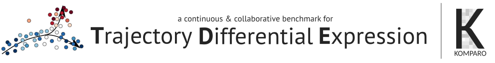

```{r setup, include = FALSE}
knitr::opts_chunk$set(
  collapse = TRUE,
  comment = "#>",
  fig.path = "docs/figures/README-",
  out.width = "100%"
)
```



**Disclaimer**: This repository is an attempt to create a workflow for continuous and collaborative benchmarking, applied on trajectory differential expression methods. It's still **a big work in progress**, and is currently only meant to explore the possibilities of such a benchmarking strategy. This is not a serious benchmark yet, but stay tuned!

---

Contributors guide: [komparo.github.io/tde](https://komparo.github.io/tde)


